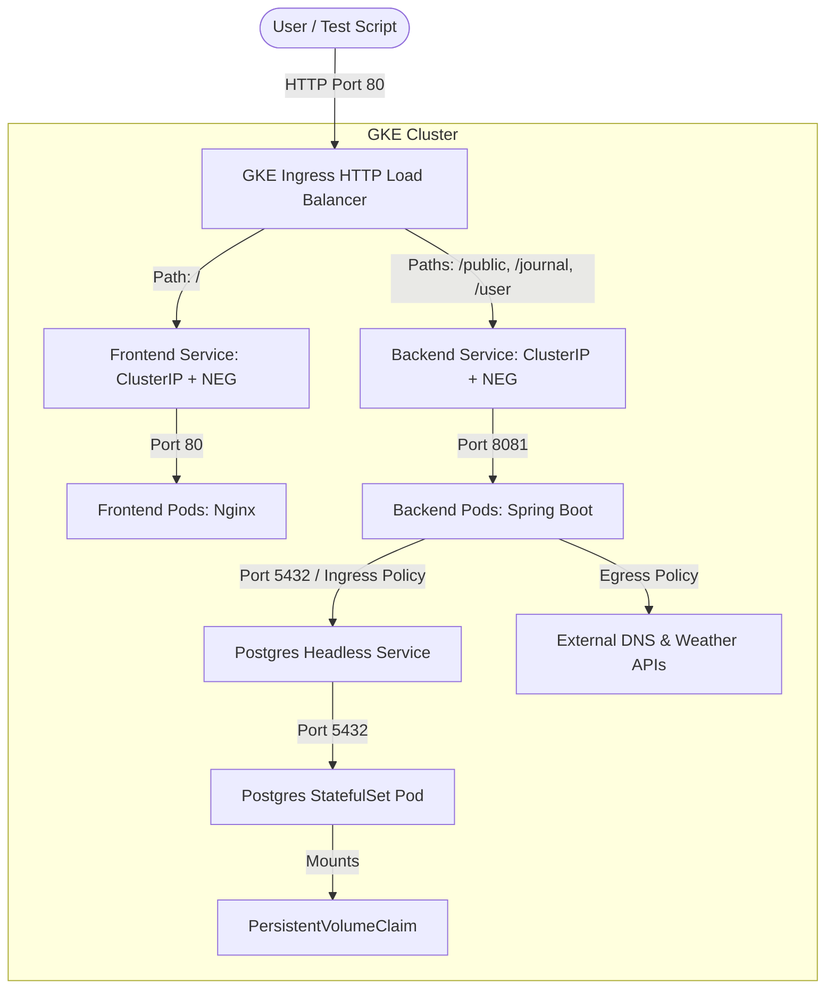

# Deploying Journal Application on GKE Standard with PostgreSQL

This document outlines the step-by-step instructions to build Docker images for the journal application, set up a Google Kubernetes Engine (GKE) Standard cluster, deploy PostgreSQL (with persistent storage) and the application services, and verify the deployment using the automated test script.

---

## Architecture Overview



---

## Step 1: Set Up Artifact Registry in GCP

Ensure you are authenticated with the Google Cloud CLI (`gcloud`) and have selected your project.

1. **Enable the container registry and GKE APIs**:
   ```bash
   gcloud services enable artifactregistry.googleapis.com container.googleapis.com
   ```

2. **Create a repository** in Google Artifact Registry (replace `us-central1` with your desired region):
   ```bash
   gcloud artifacts repositories create journal-repo \
       --repository-format=docker \
       --location=us-central1 \
       --description="Docker repository for Journal App"
   ```

3. **Configure Docker authentication**:
   ```bash
   gcloud auth configure-docker us-central1-docker.pkg.dev
   ```

---

## Step 2: Build and Push Docker Images

### 1. Spring Boot Backend
1. Build and tag the backend image:
   ```bash
   docker build -t us-central1-docker.pkg.dev/[PROJECT_ID]/journal-repo/journal-backend:latest .
   ```
2. Push to Artifact Registry:
   ```bash
   docker push us-central1-docker.pkg.dev/[PROJECT_ID]/journal-repo/journal-backend:latest
   ```

### 2. React Frontend
1. Build and tag the frontend image:
   ```bash
   docker build -t us-central1-docker.pkg.dev/[PROJECT_ID]/journal-repo/journal-frontend:latest ./frontend
   ```
2. Push to Artifact Registry:
   ```bash
   docker push us-central1-docker.pkg.dev/[PROJECT_ID]/journal-repo/journal-frontend:latest
   ```

*(Note: Replace `[PROJECT_ID]` with your GCP Project ID in all commands above).*

---

## Step 3: Create GKE Standard Cluster

Create a standard GKE cluster with default options. Standard clusters provide automatic node scaling, high availability, and support persistent disk mounting.

```bash
gcloud container clusters create journal-cluster \
    --region=us-central1 \
    --num-nodes=3 \
    --machine-type=e2-standard-2
```

Once created, fetch credentials to point `kubectl` to the new cluster:
```bash
gcloud container clusters get-credentials journal-cluster --region us-central1
```

---

## Step 4: Deploy Manifests to GKE

Ensure you are in the `JouranlAPP---Backend` directory.

### 1. PostgreSQL Database
Apply the configurations for database secrets, volume claims, and database pod:
```bash
kubectl apply -f k8s/postgres.yaml
```
Verify that the PostgreSQL pod starts and mounts storage successfully:
```bash
kubectl get pods -l app=postgres
kubectl get pvc
```

### 2. Spring Boot Backend & Frontend Services
1. Open the [k8s/backend.yaml](file:///c:/Projects/kubernets%20-dt%20application/JouranlAPP---Backend/k8s/backend.yaml) file. Replace `gcr.io/my-gcp-project/journal-backend:latest` with your pushed Artifact Registry URL (e.g. `us-central1-docker.pkg.dev/[PROJECT_ID]/journal-repo/journal-backend:latest`).
2. Open the [k8s/frontend.yaml](file:///c:/Projects/kubernets%20-dt%20application/JouranlAPP---Backend/k8s/frontend.yaml) file. Replace `gcr.io/my-gcp-project/journal-frontend:latest` with your pushed Artifact Registry URL.
3. Deploy the application components:
   ```bash
   kubectl apply -f k8s/backend.yaml
   kubectl apply -f k8s/frontend.yaml
   ```

### 3. Ingress & Network Policies (Traffic Ingress/Egress Controls)
To manage external routing under a single IP and secure pod-to-pod network traffic:
```bash
# 1. Apply NetworkPolicies (controls pod-level Ingress and Egress flow)
kubectl apply -f k8s/network-policy.yaml

# 2. Apply Ingress (provisions GCP HTTP Load Balancer to route external HTTP requests)
kubectl apply -f k8s/ingress.yaml
```

---

## Step 5: Verify Deployment and Run Tests

1. Check the Ingress status to retrieve the shared external IP address:
   ```bash
   kubectl get ingress journal-ingress
   ```
   *Note: It may take 3-5 minutes for Google Cloud to provision the HTTP Load Balancer and return an IP address.*
   
   Example output:
   ```text
   NAME              CLASS    HOSTS   ADDRESS          PORTS   AGE
   journal-ingress   <none>   *       34.120.45.67     80      5m
   ```

2. Run the automated user journey script locally, directing it to the shared Ingress IP address (default port 80):
   ```bash
   python test_journey.py http://34.120.45.67
   ```

---

## Dynatrace Monitoring Integration

The test script is fully prepared to stream workloads that trace cleanly into Dynatrace:

### 1. Tagging Headers (`X-Dynatrace-Test`)
Every HTTP request issued by `test_journey.py` appends the `X-Dynatrace-Test` header. Dynatrace APM reads this header to link request tracing to load tests:
- `LSN` (Load Test Name): Mapped to `JournalGKEJourney`
- `TSN` (Test Step Name): Mapped to the specific operation (e.g., `User_Registration`, `Create_Journal_Entry_Success`)
- `LTN` (Loop/Iteration Tag): Mapped to the current cycle index (e.g. `Cycle_1`)

### 2. CSV Data-Driven Testing (Success & Fail Scenarios)
The script loads test datasets dynamically from [test_inputs.csv](file:///c:/Projects/kubernets%20-dt%20application/JouranlAPP---Backend/test_inputs.csv) at startup:
- **Sequential Execution**: In each test cycle, the script reads a specific row from the CSV (rotating sequentially) to drive the scenario parameters.
- **Dynamic Usernames**: Appends random characters to the `username_prefix` from the CSV (e.g. `dt_user_a1b2c3d4`) to allow infinite loops without unique key conflicts during success registration steps.
- **Exceptions Testing**: Utilizes CSV parameters (like `password`, `journal_title`, `journal_content`, `journal_title_updated`, `journal_content_updated`) to execute 13 test steps, checking both success paths and expected errors (such as password mismatch logins, unique-key database violations, blank-field entity rejections, unauthenticated access denials, and post-delete resource lookups).

### 3. Rate Control
To stay within your Dynatrace monitoring quota and target testing load, it generates exactly **100 requests per 30 minutes** (1 request every 18 seconds) using elapsed execution offsets.


